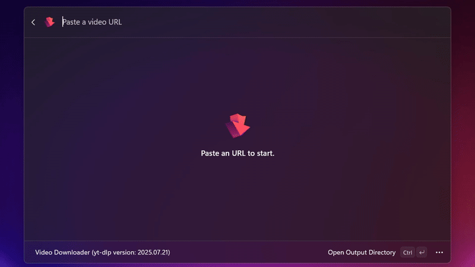

<div align="center">
     
     <div><h1>  Video Downloader<br><p>For PowerToys</p></h1></div>
     <a href="https://apps.microsoft.com/detail/9NTTBMD2DHN0?referrer=appbadge&mode=direct">
		 
     </a>
	 <br/>
     <b>A Command Palette extension for downloading videos and playlists using yt-dlp</b>     
     <br/><br/>
	 
     
</div>


<div align="center">     

</div>


> [!NOTE]
> This extension is currently in development, and is my first experience with the language.\
> Bugs are expected


# 🚀 Effortless Video Downloads with PowerToys!
Download and trim videos, audios, playlists, captions and subtitles directly from the PowerToys Command Palette using yt-dlp.

     


<div align="center">     

</div>


 
# ✨ Key Features
- Download videos from hundreds of websites ([supported websites](https://github.com/yt-dlp/yt-dlp/blob/master/supportedsites.md)).
- Simplified management: Choose output directories, set formats, and monitor progress directly from the interface.
- Parallel download: Download each video format individually with progress tracking.
- Quick audio download: Download audio with a single command.
- Playlist download support!
- Video trimming: Trim videos by setting start and end times before download
- Captions and subtitles: Download auto-captions or subtitles from a video 
- Customized output format and merging support
- Quick merging using yt-dlp's format selector expressions
- Partial Livestream download support

# 📦 Installation and Requirements

<!-- items that need to be updated release to release -->
[videoDownloaderX64]: https://github.com/DevLGuilherme/CmdPal-VideoDownloader/releases/download/v0.0.9/DevLG.VideoDownloaderforCommandPalette_0.0.9.0_x64.Msix
[videoDownloaderARM64]: https://github.com/DevLGuilherme/CmdPal-VideoDownloader/releases/download/v0.0.9/DevLG.VideoDownloaderforCommandPalette_0.0.9.0_arm64.Msix

### Requirements
1. **PowerToys v0.90 or later**  
   Install with:
   ```powershell
   winget install "Microsoft.PowerToys"
   ```
2. **yt-dlp** (any version, recommended: `Latest`)\
	Install with:
	```powershell
	winget install "yt-dlp.yt-dlp"
	```
> [!NOTE]
> If yt-dlp is not installed, the extension will show an error message and offer an option to `Install yt-dlp (winget)`

## Installation Methods

### Microsoft Store
Install from the [Microsoft Store's CmdPal Video Downloader page](https://apps.microsoft.com/detail/9NTTBMD2DHN0?referrer=appbadge&mode=direct)

### Winget
You can install the extension through windows package manager (winget) with the following command:
```powershell
winget install "DevLG.CmdPalVideoDownloader"
```
### GitHub with MsiX
Go to the [releases page](https://github.com/DevLGuilherme/CmdPal-VideoDownloader/releases), click on Assets at the bottom to show the files available in the release and download the installer for your specific platform.

|  Description   | Filename |
|----------------|----------|
| x64 | [DevLG.VideoDownloaderforCommandPalette_0.0.9.0_x64.Msix][videoDownloaderX64] |
| ARM64 | [DevLG.VideoDownloaderforCommandPalette_0.0.9.0_arm64.Msix][videoDownloaderARM64] |

# ⚙️ Settings
- `Mode`: Two modes are available **`Simple`** and **`Advanced`** (default: `Simple`)
- `Download location:` the destination directory to download (default: `User Downloads folder`)
- `Video Output format:` the output format (Container) of all downloaded videos (default: `mp4`)
- `Audio Output format:` the output format of all downloaded audios (default: `mp3`)
- `Custom format selector:` sets a custom yt-dlp [format selector expression string](https://github.com/yt-dlp/yt-dlp?tab=readme-ov-file#format-selection). If a custom string is set, the audio and video output setting will be ignored. (default: `blank`)
- `Download on Paste:` When a custom format selector is set, and this option is checked, the download will start automatically when pasting an URL. (default `unchecked`)
- `Embed thumbnail:` Embeds thumbnail into the file's metadata. (default `checked`)
- `cookies.txt file location:` the location of your [exported cookies](https://github.com/DevLGuilherme/CmdPal-VideoDownloader/edit/main/README.md#cookies) file. (default: `blank`)
> [!TIP]
> **Leave `Custom format selector` blank if you don't need a specific video or audio codec**\
> Editing software like `Premiere`, `After Effects`, `DaVinci Resolve`, may not recognize videos encoded with `VP9` or `AV1`, prefer videos encoded with `AVC1` for broader compatibility.


# 🕹️ Modes

## 🍃 Simple

It will only show available resolutions, making it easier to download without worrying about the technical details of the video.
> [!TIP]
> Download videos without worrying with codecs. (**This mode will always prefer compatibility over quality**)

<div align="center">     

</div>


## 🛠️ Advanced
This mode has all the features enabled such as QuickMerge and the full list of available formats and metadata of each format.

<div align="center">     

</div>


# 👉 How to use

### Playlist
1. Paste an `YouTube Playlist URL` or a `Videos Tab URL` from a channel.
2. Wait the data to be fetched (can take longer depending of the playlist video count).
3. Click the first item on the list `Download full playlist`
4. On the Playlist Download Page, you can:
     - Select a resolution (if available for the video).
     - Set the start and end video.
     - Check if you want just the audio.
     - Or set a custom format selector by clicking `Advanced Options`
5. Click `Download` to start

### Parallel Downloads
<div align="center">     

</div>

- Each download runs independently.
- You can download different formats, videos, audios — and monitor each download's progress in real time.

> [!WARNING]
> The only limitation applies to video trimming and livestreams, since `FFmpeg` cannot handle multiple simultaneous `m3u8 streams`.
    
### QuickMerge
- Once the list of available formats appears, you can select the formats you want to merge using the format ID present in each item in the list, typed in the URL input. For example `299+140-drc`. 
- Alternatively, you can select a video and an audio using the `Select Command` in the `Context menu` button (3 dots).

<div align="center">     

</div>

> [!NOTE]
> This feature will only work if you select exactly one video format and one audio format

### Video Trimming

<div align="center">     

</div>


- Select any video format from the list, click the 3 dots on the bottom right and select `Trim Video`.
- Set the start and end times (hh:mm:ss) and click `download`.\
**This yt-dlp feature will basically watch the video and most of the time it will take the same amount of time to complete the download.**
> [!TIP]
> In `Advanced Mode` you can make a custom selection by selecting 1 audio and 1 video with the `Select Command` before clicking `Trim Video`

### Captions and Subtitles
- If available for the video, both options will be displayed on the `Context menu` on the bottom right.

### Livestreams
Currently, there's a partial support for livestreams.
1. Paste and Livestream URL
2. Select the format and click download
3. You'll be prompted with a message saying that a terminal window will open.
4. The download will start and you have to manually interrupt the process with a <kbd>Ctrl</kbd> + <kbd>C</kbd> to close the file

### Cookies
Since `--cookies-from-browser` flag is not working on Windows ([see](https://github.com/yt-dlp/yt-dlp/issues/10927)),
the only way to download videos that require authentication, is to export and pass a `cookies.txt` file to yt-dlp, [here is how to do it](https://github.com/yt-dlp/yt-dlp/wiki/FAQ#how-do-i-pass-cookies-to-yt-dlp).


# 🤝 Contributing

This is my first open source project, so I'm especially open to feedback, ideas, and contributions.  
Feel free to share suggestions or improvements!

# 💼 TODO
- [x] Fully implement QuickMerge feature
- [x] Implement the trimming form page
- [x] Implement captions and subtitle download
- [ ] Code clean-up
- [ ] Refactor and Restructure
- [ ] Add a context command to download the video thumbnail
